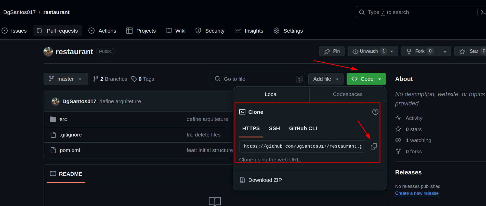
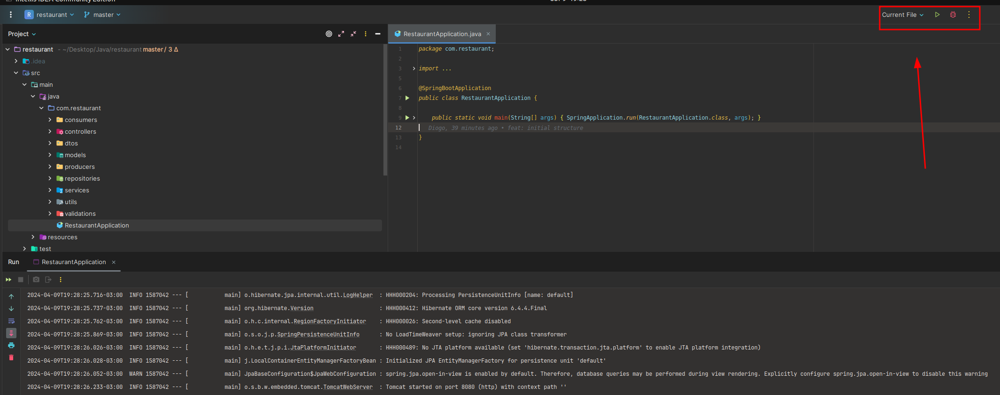
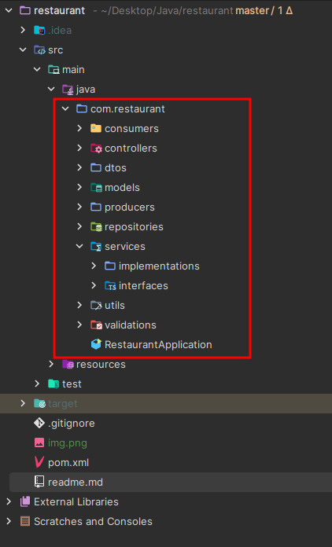

# Como rodar o projeto?

### 1 - Clone esse repositorio
https://github.com/DgSantos017/restaurant

### 2 - Abra ele com seu editor de código, recomendo o InteliJ, 

### 3 - por fim, se voce abriu com o InteliJ, pressione o botao de startar e deve ter esse resultado abaixo 

# Arquitetura da API

### consumers
-> Camada para o caso for necessário consumir algo externo

### controllers
-> Camada de entrada e saída de dados através das requisições http

### dtos
-> Camada que serve para encaminhar somente os dados que realmente vai ser necessário de uma entidade/model

### models
-> Camada que serve para modelar os atributos do banco de dados

### producers 
-> Camada para caso for preciso encaminhar alguma fila para algum serviço externo

### repositories
-> Camada de manipulação do banco de dados através das querys SQL

### services
-> Camada de regra de negócio, dividida entre interface e implementação para melhor controle dos contratos e lógica 

### utlis 
-> Camada para agrupar uma lógica que vai ser útil em diversas camadas

### validations
-> Camada para validar/tratar dados e se preciso suas exceções

